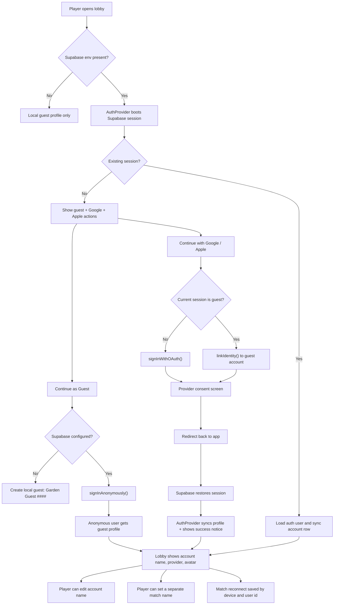

# Auth Pipeline

This fork now supports a guest-first auth flow that can upgrade into social login.

## Launch Checklist

1. Create a Supabase project.
2. Add these values to `.env`:
   - `VITE_SUPABASE_URL`
   - `VITE_SUPABASE_PUBLISHABLE_KEY`
   - `VITE_GAME_SERVER_URL`
3. Run [server/identity-server/supabase/accounts.sql](/Users/lohkeryi/Documents/Projects/-backup-flowerGame/server/identity-server/supabase/accounts.sql) in the Supabase SQL editor.
4. In Supabase Auth:
   - enable Anonymous Sign-Ins
   - enable Google
   - enable Apple
   - enable Manual Linking
5. In Google Cloud:
   - add your app origin such as `http://127.0.0.1:4174`
   - add the Supabase Google callback URL from your Supabase provider settings
6. In Apple Developer:
   - create the Services ID / web config required by the Apple provider
   - add the callback URL shown in the Supabase Apple provider settings
7. Restart the Vite dev server after adding `.env`.

## Flow

## What Is Live Versus Pending

Live in code now:

- guest-first sessions
- unique guest fallback names
- Google / Apple auth entry points in the lobby
- guest-to-social account linking path
- account sync to `public.accounts`
- reconnect data copied to the signed-in user on the same browser

Still requires your project credentials:

- `VITE_SUPABASE_URL`
- `VITE_SUPABASE_PUBLISHABLE_KEY`
- Google provider client ID / secret in Supabase
- Apple provider credentials in Supabase
